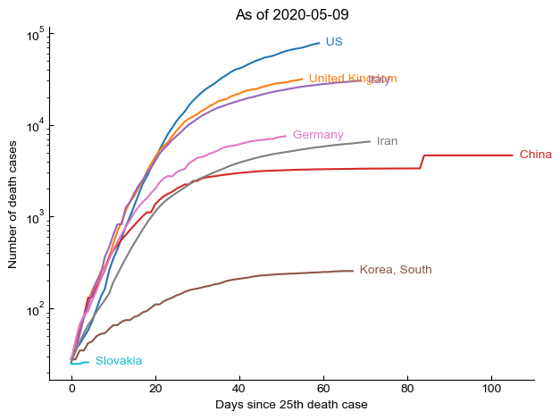

# 2019 Coronavirus case analysis by geography

## Data source
All of the datsets are downloaded from the time series datasets provided by the Johns Hopkins University Center for Systems Science and Engineering (JHU CSSE). 
- The description of the datasets could be found [here](https://github.com/CSSEGISandData/COVID-19/tree/master/csse_covid_19_data). See the section *Time series summary (csse_covid_19_time_series)*
- The datsets are updated daily from [here](https://github.com/CSSEGISandData/COVID-19/tree/master/csse_covid_19_data/csse_covid_19_time_series). 

## Analysis
- 'analysis.py' contains the script for all of the analyses;
- 'AnalysisExample.ipynb' shows examples of some plots from 'analysis.py'.

## Key finding
The plot below shows the number of deaths (on exponential scale) since the day of first death.

